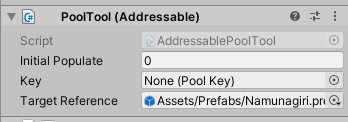

# HiraTools / AddressablePoolTool

### What?

An alternate version of [**HiraPoolTool**](../../HiraTools/HiraPoolTool), that uses Unity's excellent Addressables package.

#### How?

Check out [**HiraPoolTool**](../../HiraTools/HiraPoolTool) for the main documentation. AddressablePoolTool uses the same interface.

The only difference is that ``UnloadResource()`` method now unloads the relevant asset, and instead of a normal PoolTool, you can add AddressablePoolTool to a GameObject.

