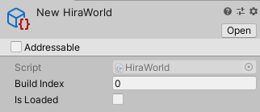
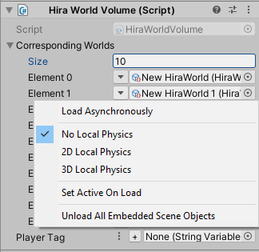

# HiraWorlds

### What?

A basic implementation of UE4's level streaming volumes into Unity.

### How?

#### 1. Setup

> Right click in your Project window and create a HiraWorld, and specify your build index in it.

> Right click in your Hierarchy and create a HiraWorld Volume.

#### 2. Customize

> You can replace the default box collider with some other kind, if you so choose, although box volumes are generally standard.

> Specify all the HiraWorlds you want loaded when the player steps into the volume.

> Press the down arrow next to the Object Reference box and you can modify the properties of the load.

> You can also specify the player tag to confirm the collision, but if left empty, the system will ignore any tags.

