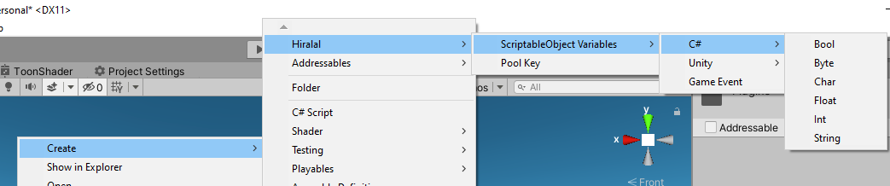
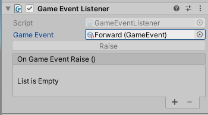
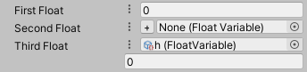
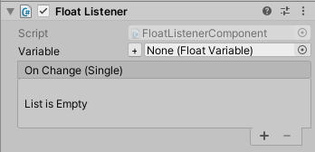

# HiraTools / ScriptableObject Variables

### What?

Check out Ryan Hipple's excellent Unite Austin 2017 [Presentation](https://youtu.be/raQ3iHhE_Kk?t=1057) for an idea of what ScriptableObject Variables are and how to make the best use of them.

It also includes information about Game Events.

# How to use?

#### 1. Game Events

> Create a game event in the project window, and then call it from wherever, to get appropriate callbacks to registered listeners.



```c#
[SerializeField] private GameEvent gameEvent = null;
void Foo()
{
    gameEvent.OnRaise += FooMore; 
}

void Bar()
{
    gameEvent.Raise();
}

void FooMore()
{

}
```

> The events can also be raised using UnityEvents via GameEventListener MonoBehaviour.



> You can also use the Raise button to test the event.

#### 2. Custom ScriptableObject Variables

> I've included several classes/structs to begin with, but you can easily create your own using generics:

```C#

using Hiralal.SOVariables.Core;

namespace UnityEngine
{
    [CreateAssetMenu(fileName = "/*NAME*/", menuName = "Hiralal/ScriptableObject Variables/Custom//*NAME*/")]
    public class /*NAME*/Variable : ScriptableObjectVariable</*NAME*/> { }
}
```
```C#

using System;
using Hiralal.SOVariables.Core;

namespace UnityEngine
{
    [Serializable]
    public class /*NAME*/Reference : ScriptableObjectVariableReference</*NAME*/>
    {
        public /*NAME*/Reference() { }
        public /*NAME*/Reference(/*NAME*/ value) : base(value) { }

        [SerializeField] private /*NAME*/Variable variable = null;
        public override ScriptableObjectVariable</*NAME*/> Variable => variable;
    }
}
```

>Make full use of the UI.
>
>Press "+" to add a new object to an empty field.
>
>You can also edit the object directly from wherever, no need to find the object, and then find the GameObject/ScriptableObject you were originally working on.



#### 3. Value Change Events

> You can subscribe to an SOVariable's OnValueChange event, to get a callback whenever the value changes.

> A much better pattern, than constantly querying the variable.
```c#
[SerializeField] private FloatReference playerHealth = null;
// assign this from the Inspector

void Awake()
{
    playerHealth.Variable += OnHealthUpdate;
}

private void OnHealthUpdate(float newValue)
{
    SetHealthBarFillAmount(newValue / maxValue);
    // playerHealth.Value is still unchanged, and you can use that for the previous value.
}
```

#### 4. Listener Components

> You can use a Listener MonoBehaviour, and its UnityEvent's corresponding Dynamic Invocations.

