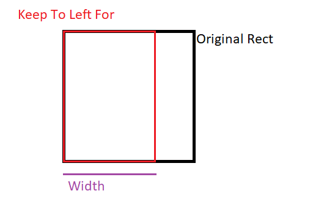
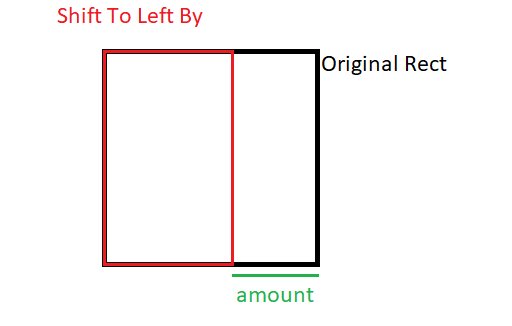
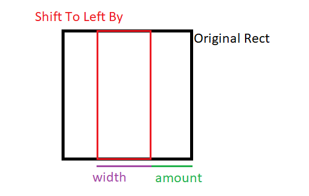

# HiraTools / Extension Methods

### What?

A bunch of neat extension methods (some of them are plain static methods) to speed up certain things.
 
### How?

All the extension methods are in the UnityEngine namespace. Use that in your `*.cs` file and you're good to go.
 
## API

### Rect Extensions

 1. #### Keeping To A Side
 
 
 
 - ``(rect).KeepToLeftFor(int width)`` - 
 > Returns a new Rect that follows the bounds of the original Rect, except for the anchor being on the left edge, and with the given ``width``.
 - ``(rect).KeepToRightFor(int width)`` - 
 > Returns a new Rect that follows the bounds of the original Rect, except for the anchor being on the right edge, and with the given ``width``.
 - ``(rect).KeepToTopFor(int height)`` - 
 > Returns a new Rect that follows the bounds of the original Rect, except for the anchor being on the top edge, and with the given ``width``.
 - ``(rect).KeepToBottomFor(int height)`` - 
 > Returns a new Rect that follows the bounds of the original Rect, except for the anchor being on the bottom edge, and with the given ``width``.
 
 2. #### Shifting To A Side
 
 
 
 - ``(rect).ShiftToLeftBy(int amount)`` - 
 > Returns a new Rect that follows the bounds of the original Rect, except for the anchor being on the left edge, and with `amount` units of space left on the right side.
 - ``(rect).ShiftToRightBy(int amount)`` - 
 > Returns a new Rect that follows the bounds of the original Rect, except for the anchor being on the right edge, and with `amount` units of space left on the left side.
 - ``(rect).ShiftToTopBy(int amount)`` - 
 > Returns a new Rect that follows the bounds of the original Rect, except for the anchor being on the top edge, and with `amount` units of space left at the bottom.
 - ``(rect).ShiftToBottomBy(int amount)`` - 
 > Returns a new Rect that follows the bounds of the original Rect, except for the anchor being on the bottom edge, and with `amount` units of space left at the top.
 
 3. #### Limited Shifting To A Side
 
 
 
 - ``(rect).ShiftToLeftBy(int amount, int width)`` - 
 > Same as ``(rect).ShiftToLeftBy(int amount)`` but limits the width to ``width``.
 - ``(rect).ShiftToRightBy(int amount, int width)`` - 
 > Same as ``(rect).ShiftToRightBy(int amount)`` but limits the width to ``width``.
 - ``(rect).ShiftToTopBy(int amount, int width)`` - 
 > Same as ``(rect).ShiftToTopBy(int amount)`` but limits the height to ``height``.
 - ``(rect).ShiftToBottomBy(int amount, int width)`` - 
 > Same as ``(rect).ShiftToBottomBy(int amount)`` but limits the height to ``height``.
 
### Type Extensions
 - ``TypeExtensions.GetSubclasses<TBase>()`` or ``typeof(TBase).GetSubclasses()`` - 
 > Returns all non-abstract subclasses of ``TBase`` as an ``IEnumerable<Type>``. Also works with interfaces, **but not with generic classes**.
 - ``TypeExtensions.GetNamesOfSubclasses<TBase>()`` or ``typeof(TBase).GetNamesOfSubclasses()`` - 
 > Returns the names of all non-abstract subclasses of ``TBase`` as an ``IEnumerable<string>``. Also works with interfaces, **but not with generic classes**.
 
### String Extensions
 - ``(string).GetAnimatorHash()`` - 
 > Returns animator hash as an integer, that can be used for setting/getting Animator properties (bool / trigger / float / int). Cache this value at initialization, because getting/setting by hashes is more efficient than doing so by strings.
 - ``(string).GetShaderHash()`` - 
 > Returns shader property ID, that can be used for setting/getting a material's properties (float / vector / color). Cache this value at initialization, because getting/setting by ID is more efficient than doing so by strings.