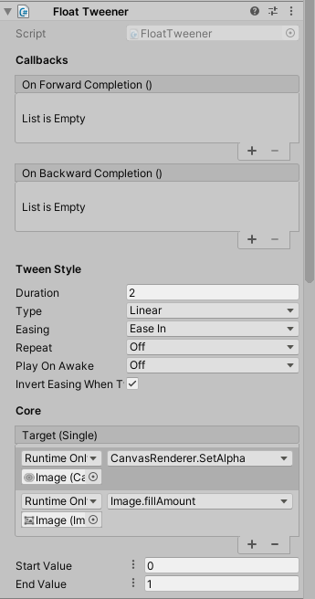
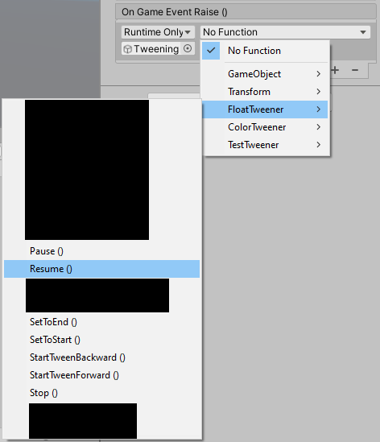

# HiraTweener

### What?

A tweening library which cuts down on a lot of code.

Also provides quite a few handy MonoBehaviours, that let you do a lot of things directly from the editor window.

As a result, the iteration times at design are significantly lowered.

## How To Use - MonoBehaviours

#### 1. Set-up

> Attach any Tweener MonoBehaviour to a GameObject. Current existing ones are:
>   * ColorTweener
>   * EulerTweener
>   * FloatTweener
>   * QuaternionTweener
>   * Vector2Tweener
>   * Vector3Tweener

> The type corresponds to the type of the variable you want to tween.



#### 2. OnForwardCompletion

> Use this to set-up a callback once the tween is completed in the forward direction.

> An example would be when you shrink down a GameObject's size to (0, 0, 0), and then set it as inactive.

> It can also be used to chain tweens together. Scroll down to [How To Control - UnityEvents](#13-how-to-control---unityevents) section for more information.

#### 3. OnBackwardCompletion

> Use this to set-up a callback once the tween is completed in the backward direction.

> Is also triggered when you use PingPong and the tween runs backwards.

#### 4. Duration

> How long you want the tween to take (in seconds), in order to complete once, in forward, or backward direction.

#### 5. Type

> The type of interpolation. The current supported ones are:
>   * Linear
>   * Quad
>   * Cubic
>   * Quart
>   * Quint
>   * Sine
>   * Exponential
>   * Circular
>   * Back
>   * Elastic
>   * Bounce

#### 6. Easing

> The type of easing you want to use with the corresponding tween. The options are:
>   * EaseIn
>   * EaseOut
>   * EaseInOut

> This setting does nothing for a Linear tween, for obvious reasons.

#### 7. Repeat

> Whether or not you want the tween to repeat itself. The current supported states are:
>   * Off (no repetition)
>   * Loop (snap back to the start position after the tween ends and then start it again)
>   * PingPong (interpolate back and forth between start and end values)

#### 8. PlayOnAwake

> Whether or not you want the tween to start when the MonoBehaviour is made active the first time.
>   * Off (the tween doesn't start automatically)
>   * Forwards (the tween starts in the forward direction automatically)
>   * Backwards (the tween starts in the backward direction automatically)

#### 9. InvertEasingWhenTweeningBackwards

> Whether or not to turn EaseIn into EaseOut (and vice versa) when tweening backwards.

> Determines whether you want the forward / backward tweens to be symmetric, or consistent.

#### 10. Target

> Now we get to the core of the tween. I apologize for having this at the bottom but because of how Unity serializes with respect to class hierarchies, there was no way around this except for making a custom editor, which wouldn't really have been very useful.

> Use UnityEvent's dynamic invocation to set a target for your tween. For example, with a ColorTweener, you can choose an Image component's ``color`` property. Or with a Vector3Tweener, you can choose a Transform component's ``position`` property.

#### 11. StartValue

> The starting value of a forward tween.

#### 12. EndValue

> The ending value of a forward tween.

**NOTE: The backward tween goes from EndValue to StartValue.**

#### 13. How to Control - UnityEvents



> You can use the provided methods to trigger appropriate behaviour. The currently supported actions are:
>   * ``StartTweenForward()`` - Tween the [Target](#10-target) from [StartValue](#11-startvalue) to [EndValue](#12-endvalue).
>   * ``StartTweenBackward()`` - Tween the [Target](#10-target) from [EndValue](#12-endvalue) to [StartValue](#11-startvalue).
>   * ``Pause()`` - Pause the ongoing tween.
>   * ``Resume()`` - Resume the currently paused tween.
>   * ``SetToStart()`` - Set the [Target](#10-target) to [StartValue](#11-startvalue).
>   * ``SetToEnd()`` - Set the [Target](#10-target) to [EndValue](#12-endvalue).

#### 14. How to Control - C#

> You can get a reference to the respective tweener using:
```c#
[SerializeField] private UnityEngine.Tweener tweener = null;
```

> And then you can use any of the functions provided in the previous section, along with these:
>   * ``IsPaused`` - Query whether the current tween is paused.

## How To Use - C#

#### 1. Create Tween

> Use this to define the properties of your tween:
```c#
var tween = new HiraTween(v => transform.position = v,
                       Vector3.zero,
                       Vector3.up,
                       2,
                       HiraTweenterpolationType.Linear,
                       HiraTweenEaseType.EaseIn,
                       CompletionCallback?.Invoke);
```

> The first parameter is the setter - what you wish to do with received value.
>
> The second parameter is the starting value of the tween.
>
> The third parameter is the ending value of the tween.
>
> The fourth parameter is the duration of the tween (in seconds).
>
> The fifth parameter is the type of interpolation. It defaults to linear.
>
> The sixth parameter is the type of easing. It defaults to EaseIn.
>
> The last parameter is a callback on the completion of the tween.

#### 2. Start the Tween

> Use this to start the created tween:
```c#
var tracker = tween.Start();
```

> Or you can use this to start it later, but have the tracker initialized:
```c#
var tracker = tween.StartLater();
```

#### 3. Control the Tween

> **Note that the tracker is only valid for as long as the tween is active.**
>
> You can query it first using:
```c#
if (tracker.IsValid)
{
    // do whatever
}
```

> If the tween was set to start later, you can start it whenever using the tracker, and query whether it has started.
```c#
if (!tracker.HasStarted)
{
    tracker.Start();
}
```

> You can also Pause / Resume the tween. Or stop it entirely.
```c#
tracker.Pause();
// ..
tracker.Resume();
// ..
tracker.Stop();
// ..
tracker.Stop(true)
// The parameter in the Stop function defaults to false, but if passed true, will perform the completion callback.
```

> You can also chain another tween at the end:
```c#
var secondTracker = tracker.Chain(new HiraTween(c => renderer.material.SetColor("_Color", c),
                                            Color.black,
                                            Color.red,
                                            0.3f);
```

> Thanks to the magic of extension methods, you can chain several tweens in the same line as well. Just make sure to start the first one:
```c#
new HiraTween(v => transform.position = v,
              Vector3.zero,
              Vector3.up,
              2)
          .Start()
          .Chain(new HiraTween(
              v => transform.position = v,
              Vector3.up,
              Vector3.down,
              4))
          .Chain(new HiraTween(
              v => transform.position = v,
              Vector3.down,
              Vector3.zero,
              2));
```

> Currently, the code automatically picks up on a few basic types of tweening, but if you wish to use some custom tweening for some custom datatype, you can do so using the last unused constructor of a ``HiraTween``. That is however, outside the scope of this document. Message me if you need help with that.