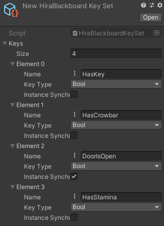

# HiraBlackboard

### What?

A blackboard API to use for HiraGOAP and HiraBT, but with the way it serializes its maps, it can be used with much more than just that.

### How?

#### 1. Setup

> Create a HiraBlackboardKeySet with different variables and their types.



> You can also synchronize all the values of a key by ticking the relevant box.

#### 2. Instantiate

> Just extend from HiraBlackboard, or add it right away to a GameObject.

> Select the KeySet that the blackboard component works on.

#### 3. Activate

> Before activating any blackboard component, call the activate method on the key set to generate its cache.

```c#
keySet.Activate();
```

#### 4. Cache the hash

> Cache the hash from the key set to use it instead of the string, for better performance.

```c#
var hash = keySet.GetHash("HasKey");
```

#### 5. Access values

> Access values with the cached hash or through the key string.

```c#
blackboard.GetBooleanAccessor("HasKey").Value = true;

if (blackboard.GetFloatAccessor(hash).Value < 75)
{
    // Do something
}
```

#### 6. Deactivate

> Destroy all instances of a blackboard component and then deactivate its target key set.

```c#
keySet.Deactivate();
```