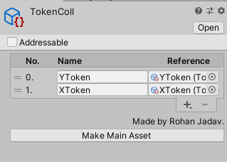

# HiraCollection

### What?

Some boilerplate for making a Reorderable List of ScriptableObjects, with all of them serialized into the same file.

### How?

#### 1. Setup

> Just extend your class from HiraCollection<T> and you're good to go.

```c#
public class AirPlane : ScriptableObject
{
}
```

```c#
[CreateAssetMenu]
public class AirPlanesCollection : HiraCollection<AirPlane>
{
}
```

#### 2. Create An Object

> Create your Object and voila, it's done.



> You can change the name of the object from the text box in the name column, and go directly to the object from the object reference column.

> This tool also covers inherited classes.

> If by happenstance, your collection stops being your main object, you can choose it from the project window and press `Make Main Asset` button to set it back as the main asset.