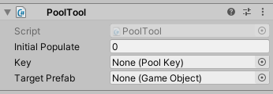
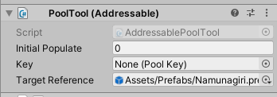
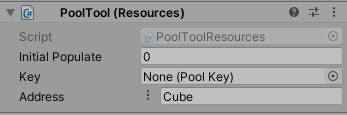
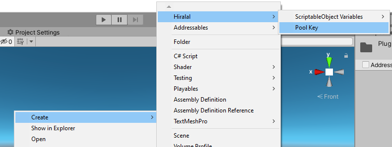

# HiraPoolTool

### What?

A pooling solution for Unity, with an emphasis on ease of use, while retaining the maximum possible performance.

## How To Use

#### 1. Set-Up

> Attach the PoolTool MonoBehaviour to any GameObject and then assign the appropriate prefab.



> You can alternatively use AddressablePoolTool if you have Addressables installed.
> Just add ``HIRAENGINE_ADDRESSABLES`` to your Scripting Define Symbols.



> As of release 1.11 you can also use PoolTool (Resources).



#### 2. Key-Referencing

> In your project window, right-click, and go to *Create* / *Hiralal* / *Pool Key* to create a pool key.



> Assign this key to your PoolTool.


> This key can be used from other MonoBehaviours to gain a direct reference to the pool.

```c#
[SerializeField] private PoolKey key = null;

private void Foo()
{
    var pool = key.GetPool();
    // ..
}
```

#### 3. Loading

> Once you have the reference to a pool, load the resource, and provide a way to get the target component on your Prefab.
```c#
pool.LoadResource(g=>g.GetComponent<SomeComponent>());
```

> The second parameter in ``pool.LoadResource`` method will override the number set from inspector, and lets you initialize the pool with a set number of objects.
```c#
pool.LoadResource(g=>g.GetComponentInChildren<SomeOtherComponent>(), 20);
```

> If you pass ``null`` as the first parameter, or do not provide it, then PoolTool will automatically choose ``g=>g.transform`` as the first parameter.

**NOTE: It is not possible to retrieve pooled instances before loading the resources.**
> You can query whether the resource has been loaded.
```c#
if (pool.IsResourceLoaded)
{
    // ..
}
```

> For a ``PoolTool``, the system will initialize itself when you call LoadResources. For ``PoolTool (Resources)`` the system will use ``Resources.LoadAsync`` to load the appropriate prefab.


#### 4. Retrieving

> You will need to pass the correct type you initialized the pool with, or the system will throw a ``NullReferenceException``
```c#
var pooledInstance = pool.GetPooledInstance<SomeComponent>();
```

> You can use this in association with [**HiraTimerEvents**](../HiraTimer) in order to auto-return to pool. Or you can just use the provided method:
```c#
var pooledInstance = pool.GetPooledInstanceWithAutoReturn<SomeOtherComponent>(duration, ignoreTimescale);

// the first parameter is the timer in seconds after which the instance will return back to pool.
// this is quite useful for things like Particle Systems, where you might not always want to keep track.

// the second parameter uses realtime timers, if passed true, it defaults to false otherwise.
``` 

#### 5. Returning

> Just use this to return the instance to pool
```c#
pool.ReturnInstanceToPool(pooledInstance);
```

#### 6. Unloading

> It only makes sense to clear the pool up when not needed, so you can use this to destroy all pooled and loaned instances.
```c#
pool.UnloadResource();
```

**NOTE: Unloading resources will destroy ALL instances of the pooled object, regardless whether they are still inside the pool, or outside.**

> A ``PoolTool (Resources)`` will not unload the resources from memory however. You would manually need to call ``Resources.UnloadUnusedAssets()``.
> An ``AddressablePoolTool`` will however unload the relevant asset reference.