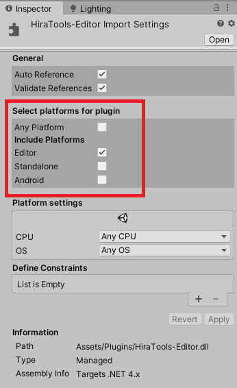

# HiraTools

### What?

 A bunch of tools that cut down significantly on the boilerplate you might need to write.
 
### How to use?

 Just grab the latest release and put it in your Unity Project's `Assets/Plugins` folder.
 
 This repository contains all of the code involved in this project, so if you wish to build it yourself, you can do that as well. Or you can just import the *.cs files directly into your Unity project.
 
 The detailed documentation for any specific API is in the corresponding folder. Follow the links in the [Contents](#contents) section. 
 
 Keep package dependencies in mind however.
 
 - `HiraTools-Addressables.dll` requires the Addressables package from Unity Package Manager.
 
> #### Please also keep in mind to mark ``HiraTools-Editor.dll`` assembly as Editor-Only in your Unity Inspector.
> 
 
## Contents
 
 - **[Extension Methods](HiraTools/Extension%20Methods)**
 - **[HiraCoroutines](HiraTools/HiraCoroutines)**
 - **[HiraEvents](HiraTools/HiraEvents)**
 - **[HiraLogger](HiraTools/HiraLogger)**
 - **[HiraPoolTool](HiraTools/HiraPoolTool)**
 - **[HiraPoolTool-Addressable](HiraTools-Addressables/HiraPoolTool)**
 - **[HiraSaves](HiraTools/HiraSaves)**
 - **[HiraTimer](HiraTools/HiraTimer)**
 - **[HiraTweener](HiraTools/HiraTweener)**
 - **[ScriptableObject Variables](HiraTools/ScriptableObject%20Variables)**
 - **[SerializedInstance](HiraTools/SerializedInstance)**

# Created by Rohan.
### Thanks.